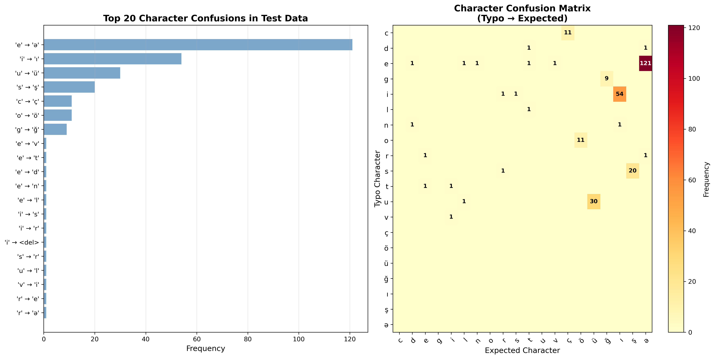

# Confusion Matrix Generation Guide

## Automatic Generation (Recommended)

When you run the test script, the confusion matrix is automatically generated:

```bash
python test_spell_checker.py \
    --test-data YOUR_TEST_FILE.json \
    --weighted \
    --model ../outputs/weighted_spell_checker.pkl \
    --output ./test_results
```

This will create:
- `test_results/evaluation_results.json`
- `test_results/evaluation_report.txt`
- `test_results/confusion_matrix.png` ← **Confusion matrix visualization**

## Manual Generation from Existing Results

If you already have `evaluation_results.json` and want to regenerate the confusion matrix:

```bash
python generate_confusion_matrix.py \
    --results ./test_results/evaluation_results.json \
    --output ./confusion_matrix.png
```

## Using in Your Report

1. **Generate the confusion matrix** using one of the methods above

2. **Copy to your report directory**:
   ```bash
   cp test_results/confusion_matrix.png /path/to/your/report/
   ```

3. **Reference in markdown** (already included in REPORT.md):
   ```markdown
   
   ```

4. **Convert to PDF** with Pandoc:
   ```bash
   pandoc REPORT.md -o report.pdf --pdf-engine=xelatex
   ```

## What the Confusion Matrix Shows

The confusion matrix visualization has two panels:

**Left Panel: Top 20 Character Confusions**
- Horizontal bar chart
- Shows most frequent character substitution errors
- Format: 'typo character' → 'expected character'

**Right Panel: Confusion Matrix Heatmap**
- Shows relationships between confused characters
- Darker colors = more frequent confusions
- Numbers indicate exact frequencies

## Common Character Confusions in Azerbaijani

Expected patterns you should see:

1. **Vowel confusions**: a ↔ ə, e ↔ ə, o ↔ ö, u ↔ ü
2. **Consonant diacritics**: s ↔ ş, c ↔ ç, g ↔ ğ
3. **Special character omissions**: ı ↔ i

These patterns reflect:
- Keyboard input difficulties (special characters require Alt codes or specific layouts)
- OCR errors in digitized text
- Non-native writer mistakes
